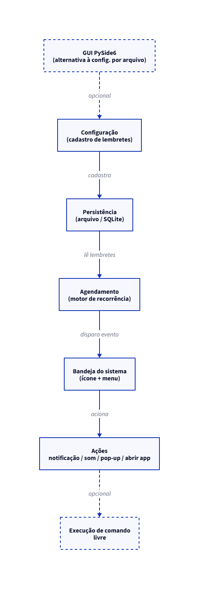

# RememberME — Análise de Requisitos (Etapa 1)

**Curso:** IEFP — Programação, Nível 5 (formador: CID)
**Grupo:** Felipe Ribeiro, Niley Barros, Renato Moraes

---

## 1. Identificação do projeto

- **Nome provisório:** RememberME
- **Elementos do grupo:** Felipe Ribeiro, Niley Barros, Renato Moraes
- **Descrição resumida:** aplicação desktop que roda em segundo plano e lembra o formador de executar tarefas administrativas recorrentes durante a aula, como fechar sessão e/ou fazer a chamada, através de notificações configuráveis por horário fixo ou recorrente.
- **Público-alvo:** formadores do IEFP e, de forma mais ampla, qualquer formador que precise cumprir tarefas administrativas em horários específicos enquanto está concentrado em dar aula.

---

## 2. Descrição do Problema

Durante a aula, o formador fica concentrado no conteúdo e nas dúvidas dos formandos, e tarefas administrativas simples acabam ficando para trás: fechar a sessão de acesso, fazer a chamada no horário certo, entre outras rotinas burocráticas. Nenhuma dessas tarefas é complexa, mas todas dependem de o formador lembrar delas sozinho, no meio de uma aula que já exige atenção total.

Quem sente esse problema é o próprio formador, mas o atraso ou esquecimento reflete na instituição, que perde o controlo de presença ou de sessão em tempo real. Um sistema de lembretes que funcione sem exigir atenção contínua do formador — soando, mostrando um pop-up ou abrindo o Teams automaticamente — resolve isso sem adicionar mais uma coisa para ele memorizar.

---

## 3. Objetivos da solução

**Objetivo principal:** reduzir os esquecimentos de tarefas administrativas recorrentes do formador durante a aula, por meio de lembretes automáticos e configuráveis.

**Objetivos específicos:**
- Permitir o cadastro de lembretes com horário fixo ou recorrente configurável (ex.: a cada 1h, das 8h às 14h).
- Notificar por diferentes canais: notificação do sistema, alerta sonoro, pop-up na tela ou abertura automática de uma aplicação/URL.
- Funcionar em segundo plano, sem interferir no uso normal do computador.
- Rodar em Windows, macOS e Linux.
- Iniciar automaticamente junto com o sistema operacional.

**Resultados esperados:** uma aplicação funcional com motor de agendamento, ícone na bandeja do sistema, persistência local dos lembretes e pelo menos três tipos de ação de notificação. O código é escrito para ser multiplataforma desde o início, mas os testes e o empacotamento formal desta fase ficam restritos ao Windows, por limitação de acesso a hardware macOS/Linux por parte do grupo — validação nos outros sistemas fica para uma etapa posterior.

---

## 4. Público-alvo

Formadores do IEFP, e formadores em geral, que ministram aulas presenciais ou remotas e precisam cumprir tarefas administrativas recorrentes sem depender exclusivamente da própria memória.

---

## 5. Requisitos funcionais

Os requisitos abaixo estão organizados por ciclo evolutivo. **MVP** marca o que é essencial para o produto funcionar; **Incremental** marca o que é desejável, mas condicionado ao tempo disponível.

| ID | Requisito | Ciclo Previsto | Status |
|---|---|---|---|
| RF01 | O sistema deve disparar uma notificação de sistema num horário fixo pré-definido. | 1 | MVP |
| RF02 | O sistema deve permitir configurar a recorrência de um lembrete (ex.: a cada X minutos/horas) dentro de uma janela de horário (ex.: 8h–14h). | 2 | MVP |
| RF03 | O sistema deve rodar em segundo plano com um ícone na bandeja do sistema, com um menu básico (ex.: sair, ver lembretes ativos). | 3 | MVP |
| RF04 | O sistema deve persistir os lembretes localmente (arquivo ou SQLite), sem depender de conexão de rede. | 4 | MVP |
| RF05 | O sistema deve vir com um conjunto de tarefas administrativas pré-cadastradas (ex.: fechar sessão, fazer chamada). | 4 | MVP |
| RF06 | O sistema deve permitir que o formador adicione, edite ou remova os próprios lembretes. | 4 | MVP |
| RF07 | O sistema deve suportar múltiplos tipos de ação por lembrete: notificação de sistema, alerta sonoro, pop-up na tela, ou abertura de uma aplicação/URL pré-configurada. | 5 | Incremental (opcional) |
| RF08 | O sistema deve iniciar automaticamente junto com o sistema operacional. | 6 | Incremental (opcional) |
| RF09 | O sistema deve permitir a execução de um comando arbitrário configurado pelo usuário como ação de um lembrete. | 7 | Incremental (opcional) |
| RF10 | O sistema deve oferecer uma interface gráfica (PySide6) para gestão dos lembretes, como alternativa à configuração por arquivo. | — | Incremental (opcional) |

---

## 6. Requisitos não funcionais

| ID | Requisito |
|---|---|
| RNF01 | Compatibilidade multiplataforma: o código-fonte deve ser escrito para rodar em Windows, macOS e Linux. Testes e empacotamento formal desta fase cobrem apenas Windows. |
| RNF02 | Baixo consumo de recursos, compatível com uso contínuo em segundo plano durante toda a jornada de trabalho do formador. |
| RNF03 | Usabilidade: a configuração de um lembrete não deve exigir conhecimento técnico do formador. |
| RNF04 | Persistência local dos dados, sem dependência de conexão à internet. |
| RNF05 | Segurança: quando o RF09 (execução de comando) estiver ativo, o sistema deve pedir confirmação e registrar em log o comando executado. |

---

## 7. Representação da solução

A arquitetura é dividida em quatro módulos, pensados para permitir divisão de trabalho entre os três elementos do grupo com o mínimo de conflito de merge: Configuração → Persistência → Agendamento → Bandeja do sistema → Ações.

Fonte da arquitetura: `01-arquitetura.d2`. Figura 1 (gerada a partir do `.d2`):

---

## Nota sobre escopo e tempo disponível

O grupo dispõe de 32 horas de aula para o projeto completo (5 etapas). Os requisitos marcados como MVP (RF01–RF06) formam o núcleo funcional do RememberME e são a prioridade. Os requisitos incrementais (RF07, RF08, RF09, RF10) só entram se sobrar tempo depois do núcleo estar estável e testado — essa decisão será revisada ao longo do desenvolvimento, conforme o ritmo real do grupo com Git, GitHub e Python.
